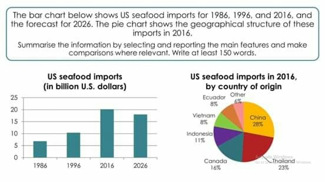

# Full IELTS Academic Writing Task 1 SAMPLE ESSAY Band 9 | Bar Chart + Pie Graph - YouTube (www.youtube.com)

<https://www.youtube.com/watch?v=fDfFRAm1ye0&ab_channel=FastrackIELTS>

## Description

Here’s a full IELTS Academic Writing Task 1 Band 9 sample essay. The task contains two charts, a bar chart and a pie chart or graph, and was reported on one ...

------------------------------------------------------------------------

- Essay structure:
  - introduction
    - Write 1/2 sentence introducing the task
    - What information there is in the charts
  - overview
  - body paragraph 1
  - body paragraph 2

------------------------------------------------------------------------

## Task 1

### Text
The bar chart below shows US seafood imports for 1986, 1996, and 2016, and the forecast for 2026. The pie chart shows the geographical structure of these imports in 2016. Summarise the information by selecting and reporting the main features and make comparisons where relevant. Write at least 150 words.

### Introduction
The graphs provide information on the volume of seafood imports in the United States between the years 1986 and 2016 with a prediction for 2026 and illustrate from which countries the seafood was imported in 2016.

> The bar chart below shows / The  pie chart  shows
> ---The graphs provide information
