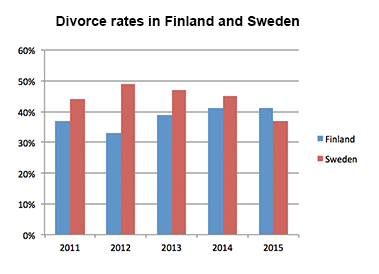

<https://www.youtube.com/watch?v=O5eb1uWsLrU>
## Description

Learn how to describe bar charts in IELTS Writing task 1 to get a band 9 for your writing! In this tutorial you will see a sample bar chart question + useful...

## Tags

#ielts #video #write #demo

------------------------------------------------------------------------

## Summary
- Introduce the chars in `Introduction` section
- Describe general trends and features of chards in `Overview` section
- Write about specific features of chards in `Body 1` and `Body 2` section
- The goal of task 1 is describe the presented information in a clear way
- Do not present personal opnion
- Do not write a conclusion section in task 1
- Group specific features into different paragraphs (coherent - coherence and cohesion)
- Into `Body 1/2`` Write specifig features (numbers and percentages)
- Describe the beguests biggest varient informations persented in the chart

## Task 1

The bar chart shows the divorce rates in two European countries from 2011 to 2015. Summarise the information by selecting and reporting the main features, and make comparisons where relevant|

Overall, Sweden experienced a downward trend, while Finland showed an upward trend throughout the period. Both countries' divorce rates had some fluctuations. Although Finland initially had a lower rate, it outraced Sweden at the end of the period.

Sweden's divorce rate was about 45% in 2011, being higher than Finland's rate by approximately 8%. Then, it rose to almost fifty percent in 2012. However, the figure showed a gradual decrease to about 47% in 2013, and continued to decline steadily to the end of the period, reaching around 45% in 2014 and hitting a low-point of about 37% in 2015.

Percentage of divorces in Finland was less than 40% in 2011, and it decreased in 2012, when about one third of marriages in Finland ended with a divorce (as opposed to almost a half in Sweden). However, the figure experienced a steady growth during the next two years. It rose to approximately 39% in 2013, then increased by around 3% in 2014, and remained steady for the next year, outracing the rate of Sweden.

### Overview

Overall, Sweden experienced a downward trend, while Finland showed an upward trend throughout the period. Both countries' divorce rates had some fluctuations. Although Finland initially had a lower rate, it outraced Sweden at the end of the period.

##### Paraphrases
| Before | After |
|:---:|:---:|
|shows|provides information about|
|the divorce rates|the percentages of divorces|
|in two European countries|in Finland and Sweden|
|from 2011 to 2015|between 2011 and 2015|

#### Tips
- Write a paraphrase presented in question task
- Never change the graphics name
- The word `shows` can be replaced `provides information about`, `represents`, `ilustrates`
- It's good to be specific in `Introduction` section`
- Try to bring extra informations from presented chard

## Overview
Overall, Sweden experienced a downward trend, while Finland showed an upward trend throughout the period. Both countries' divorce rates had some fluctuations. Although Finland initially had a lower rate, it outraced Sweden at the end of the period.

### Chard information
- Finland's rate increases
- Finland's rate has fluctuations
- Sweden's rate decreases
- Sweden's rate has fluctuations
- In the beginning Sweden's rate was lower than Finland's rate
- In the end Sweden's rate was higher than Finland's rate

### Tips
- Briefly describe major trends on presented chard (2 to 4 key features)
- Never write numbers, percentages and dates in the overview
- The `Overview` paragraph contains only general informations
- In charts look separately which information
- As last observation look for different between 2 information on start and end
- Always tarte with `Overall` in `Overview` section
- It was used `while` and `Although` as word link
- Use words like `both` to describe common features between 2 informations

## Feature 1
Sweden's divorce rate was about 45% in 2011, being higher than Finland's rate by approximately 8%. Then, it rose to almost fifty percent in 2012. However, the figure showed a gradual decrease to about 47% in 2013, and continued to decline steadily to the end of the period, reaching around 45% in 2014 and hitting a low-point of about 37% in 2015.

### Tips
- The most importent thing is organize logically
- Use words as `around`, `approximately`, `about`, `almost` as not exactly 
- Use words  as `however` as changes trends point

## Feature 2
Percentage of divorces in Finland was less than 40% in 2011, and it decreased in 2012, when about one third of marriages in Finland ended with a divorce (as opposed to almost a half in Sweden). However, the figure experienced a steady growth during the next two years. It rose to approximately 39% in 2013, then increased by around 3% in 2014, and remained steady for the next year, outracing the rate of Sweden.
