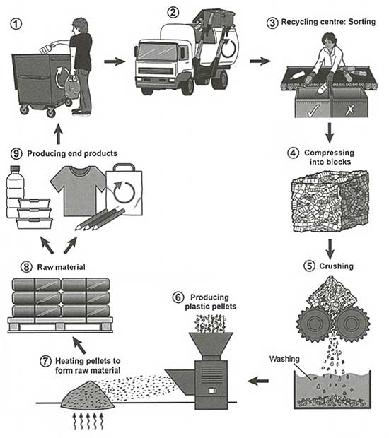

# How to Describe a Process Diagram [IELTS Writing Task 1 Band 9 Guide] - YouTube (www.youtube.com)

<https://www.youtube.com/watch?v=q9evxl9hCg8>

## Description

Sample essay ➡ https://www.ieltsessaybank.com/manufacturing-process-for-making-sugar/In this video, I’m going to show you how to describe an IELTS process di...

## Tags

#video #ielts #writing #tips

------------------------------------------------------------------------

## Summary
- Do not describe how diagram start or end in `Overview` section
- Do not call a manufacture process a man-made process
- State all the main stage in `Overview` section
- Try to separate into paragraphs different stage of process in body 1 and 2
- Use words like to, which, so that 

## Task 1
|  |
| :---: |
| How sugar is processed from sugar cane |

### Introduction
The diagram displays how sugar is manufactured from sugar cane.

### Overview
Overall, it is a linear process consisting of four main stages: farming, crushing, separating and drying.

### Body 1
The first step is to grow sugar cane and it takes about 12 to 18 months for it to mature. After it has fully grown, it is harvested either manually or mechanically. The manual method involves farmers removing the leaves first and then chopping the canes, while the mechanized method uses machines to cut the canes directly.

### Body 2
The harvested canes are then crushed in a mill to extract the juice, which is later on purified using a limestone filter. Next, the purified juice is boiled in an evaporator to remove water, which concentrates it into a syrup.The syrup is then poured into a centrifuge where it is spun at high speed to separate the sugar crystals. Finally, the crystals are dried and cooled and the end product is sugar.
