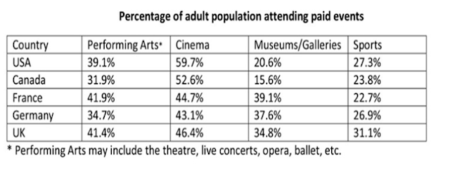

# IELTS Academic Task 1 Writing: Tables - YouTube (www.youtube.com)

<https://www.youtube.com/watch?v=bgO-qjK3l2A>

## Description

One of the possible infographics you will need to summarize for the IELTS Academic writing test (Task 1) will be in the form of a table. This may be tricky b...

## Tags

#ielts #video #writing #tips

------------------------------------------------------------------------

## Summary
- Don't analyse, give a conclusion, guess reason
- Look for main features and comparisons
- Take information of:
  - highs lows
  - commonalities
  - anomalies (out of the ordinary)
  - similarities
  - differences
- Have in mind the header (categorization), and first column (countries)
- In order to split into 2 body look for commons information in table
- 

## Task 1

|  |
| :---: |
| *The table below gives information about the percentage of adults who paid for admission to various entertainment events in five nations in 2012. Summarize the information by selecting and reporting the main features, and make comparisons where relevant.* |

### Introduction
The table presents data on the entertainment purchases of adults in Canada, the USA, France, Germany, and the UK in 2012. The information is presented in terms of average adult attendance as a percentage of the population.

### Overview
Overall, movies were the most popular form of entertainment among adults in all five countries, with museums/galleries and sporting events being the least popular in North America and Europe, respectively.

### Body  1
While the performing arts do not show a great discrepancy in adult attendance, ranging from 31.9% in Canada to 41.9% in France, it is different for museum and gallery visits. France nearly doubles the USA in this regard (39.1% to 20.6%), while all three European countries, whose rates are relatively similar, more than double Canada's rate of 15.6%.

### Body 2
In terms of sports, there is a similarly small variance among the five countries, with the UK boasting the most tickets sold to adults at 31.1% of the population, and France the least, at 22.7%. Cinemas, meanwhile, attract over half the adult populations of Canada and the USA, while in Europe, the high is just 46.4% in the UK.
