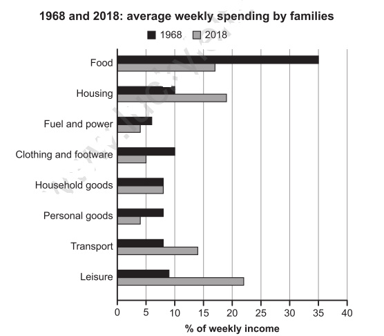

# IELTS Writing Test 115

## Tags
#ielts #practice #writing

------------------------------------------------------------------------

## Task 1
| The chart below gives information about how families in one country spent their weekly income in 1968 and in 2018. Summarise the information by selecting and reporting the main features, and make comparisons where relevant. Write at least 150 words. |
| :---: |
|  |

### Introduction
The chart presents how families spend their weakly income from 1968 and 2018.

### Overview
Overall, the spends of a family weekly income has changed significantly in the past years. It's evidenced by the graph showing that spendings in some products has decreased and others has increased. The most two biggest changes are in food and leisure. The spends as housing, and leisure are both examples of increased in past years. However, spends in food and leisure has lowed.

### Body 1
Described by the graph, the higher spend in 1968 was in food with 35 percentage followed by clothing and footware with 10 percentage. Those bigs spends numbers has been replaced for others as hosing and leisure

food - 35%
clothing and footware - 10%

### Body 2
2018

## Task 2
Some people believe that professionals, such as doctors and engineers, should be required to work in the country where they did their training. Others believe they should be free to work in another country if they wish. Discuss both these views and give your own opinion. Give reasons for your answer and include any relevant examples from your own knowledge or experience. Write at least 250 words.
