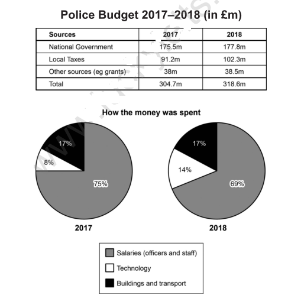

# IELTS Writing Test 116

## Tags

#ielts #practice #writing

------------------------------------------------------------------------

## Task 1
The table and charts below give information on the police budget for 2017 and 2018 in one area of Britain. The table shows where the money came from and the charts show how it was distributed. Summarise the  information by selecting and reporting the main features, and make comparisons where relevant. Write at least 150 words.

## Task 2
 Some children spend hours every day on their smartphones. Why is this the case? Do you think this is a positive or a negative development? Give reasons for your answer and include any relevant examples from your own knowledge or experience. Write at least 250 words.
