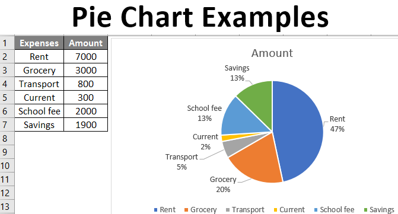

# IELTS Writing Part 1 Practice

## Tags

#ielts #practice #writing

------------------------------------------------------------------------
The table and the char bellow shows how usually a family spences in a month goes around this year.

## Introduction
- Rent is the most spence
- Rent is more then the second most expansive one

The table describe approximately how families expend there money in a month. The pai char shows the percentages of each type categorized in the table.

## Overview
Overall, the greatest costs of a family, described by the table and the char, is the rent with more then the double compare with grocery which is the second most expansive. Those overlay are follow by school fee which has a also considered amount in the group but stay in the third position followed by saving.
