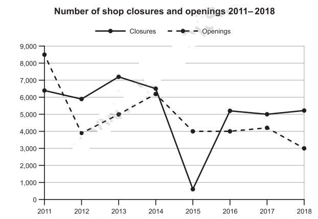

# IELTS Writing Test 116

## Tags
#ielts #practice #116 #writing

------------------------------------------------------------------------

## Task 1
The graph below shows the number of shops that closed and the number of new shops that opened in one country between 2011 and 2018. Summarise the information by selecting and reporting the main features, and make comparisons where relevant. Write at least 150 words.

### Answer
#### Introduction
The graph illustrates the difference between opening and closures shops in the period of 2011 and 2018.

#### Overview
Overall, the graph evidences the high declines of opening shops compared between closuring in the same dates. In save years, the period described by the graph, the amount of opening shops became lower then the closed having some declines and accessions.

#### Body 1
- Created started higher than closed
- Created ended lower then clused

#### Body 2

## Task 2

Nowadays, a growing number of people with health problems are trying alternative medicines and treatments instead of visiting their usual doctor. Do you think this is a positive or a negative development? Give reasons for your answer and include any relevant examples from your own knowledge or experience. Write at least 250 words.
